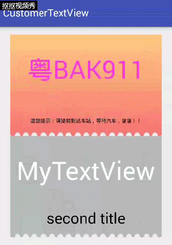

# CustomerTextView
仿小猪巴士的验票显示


#显示效果




#使用方法
1.xml

```xml
<android.com.customertextview.MyTextView
    android:id="@+id/secondTV"
    android:layout_width="300dp"
    android:layout_height="200dp"
    android:layout_below="@+id/firestTV"
    android:background="@drawable/ticket_intercity_gray_bg"
    android:paddingBottom="40dp"
    app:firstColor="#ffffff"
    app:secondColor="#000000"
    app:firstTitleSize="50sp"
    app:secondTitleSize="30sp"
    app:firstTitle="MyTextView"
    app:secondTitle="second title"/>
```
2. java

```java
myTextView01 = (MyTextView)findViewById(R.id.firestTV);
myTextView01.setBackground(getResources().getDrawable(R.drawable.ticket_intercity_light_bg));
myTextView01.setFirstTitle(getResources().getString(R.string.bus_name));
myTextView01.setSecondTitle(getResources().getString(R.string.warmly_hint));
myTextView01.setSecondTitleSize(20);
myTextView01.setOnClickListener(new View.OnClickListener() {
    @Override
    public void onClick(View v) {
        Toast.makeText(getApplicationContext(),"Click First",Toast.LENGTH_SHORT).show();
    }
});
myTextView01.setOnLongClickListener(new View.OnLongClickListener() {
    @Override
    public boolean onLongClick(View v) {
        Toast.makeText(getApplicationContext(),"Long Click First",Toast.LENGTH_SHORT).show();
        return true;
    }
});
```
